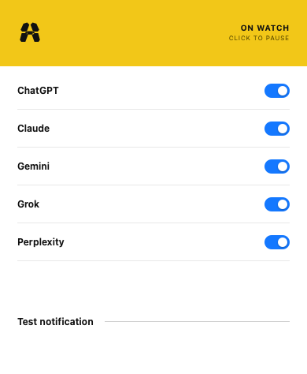

# ANYA

**AI Needs Your Attention.**

AI can work in parallel. Your attention can't.

This extension notices when a web AI wants you, and tells you. You decide whether to go there.

Give it a request, leave the tab, do something else. When the response finishes or it asks you something, you get a system notification. Click it to return to that tab, or don't. Close the tab if you don't care anymore.

No scoring. No inbox. No automatic switching.



## Supported AI products

- ChatGPT (`chatgpt.com`, `chat.openai.com`)
- Claude (`claude.ai`)
- Gemini (`gemini.google.com`)
- Grok (`grok.com`, `x.com/i/grok`)
- Perplexity (`perplexity.ai`)

Notifications can be enabled or disabled globally or per provider.

## How it works

1. Detect when a supported AI starts working.
2. Detect when it finishes or appears to need input.
3. Send a native system notification if you are not already viewing that tab, with a short chime.
4. If you click the notification, focus that browser window and tab.

Detection combines provider-specific page controls, chat-stream completion, and a fallback that waits for response text to settle. A small local heuristic checks only the end of a response for direct questions or requests.

On supported pages, a page-world script wraps `fetch` so it can notice when a chat stream ends. It clones the response, reads that copy until it finishes, and discards the bytes. The only message it posts is a `STREAM_COMPLETE` ping, with no response text.

## Privacy

Full policy: [PRIVACY.md](PRIVACY.md). Detection happens locally in your browser.

- No backend or extension-originated network requests
- No analytics
- No API keys
- Conversation text is classified in the page and is not sent to a server
- The extension worker does not store conversation content
- Session storage keeps lifecycle state for open tabs, including the tab URL (which can contain a conversation id)

## Install

Works in Chrome and other Chromium-based desktop browsers.

1. Open your browser's extensions page, such as `chrome://extensions`.
2. Turn on **Developer mode**.
3. Click **Load unpacked**.
4. Select this repository folder.
5. Refresh any supported AI tabs that were already open.
6. Open the extension and select **Test notification**. You should hear a short chime.

If the test does not appear, allow notifications for your browser in your operating system settings. System notifications identify the browser as the sender.

## Development

The extension uses plain JavaScript with no package install or build step.

```text
manifest.json          Chrome Manifest V3 declaration
background.js          settings, notifications, and tab focus
offscreen.*            notification chime (service workers cannot play audio)
content.js             per-tab observer and completion state machine
intercept.js           page-world fetch probe; discards stream bytes locally
shared/providers.js    provider adapters and selector fallbacks
shared/classifier.js   local input-request heuristic
shared/streams.js      chat-stream URL matching
shared/policy.js       notification and suppression policy
popup.*                global and per-provider settings
icons/                 extension and notification artwork
tests/                 dependency-free Node tests
```

Validate changes with:

```bash
node --test tests/*.test.js
node --check background.js
node --check content.js
node --check intercept.js
node --check offscreen.js
node --check popup.js
```

Package a Chrome Web Store zip with `scripts/package.sh`. Listing copy, screenshots, and dashboard answers are in [`store/listing.md`](store/listing.md).

Provider sites can change their interfaces without notice. Detection adapters are isolated in [`shared/providers.js`](shared/providers.js) so selector changes remain local and testable.
